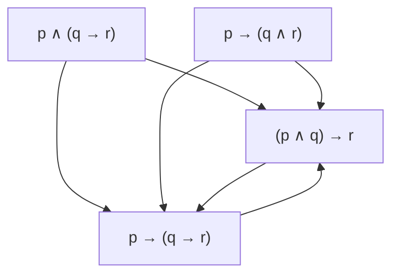

# Oblig 1 - Sondre Fosså

## 1 Detuctive reasoning

### Exercise 1

#### A

Since the conlcusion is false, one of E, F and B need to be false for the inference to be valid.
If F is false then E has to be false and the other way around so E and F have to be false.
C has to be invalid to make E invalid in the first premise and B has to be valid by the last one.
D is false

#### B

B is true, rest is false
B is true from the first premise which means one of D and E have to be false
If either is false the other one is which means both are false

### Exercise 2

#### A

The assumptions are not enough to guarantee that C / P is valid, and also not enough to guarantee that C / P
is NOT valid.
P |= C only means that C is true when P is true, but since it only works one way it doesent guarantee C / P

#### B

Under the given assumptions, P / Q is valid.

Since P |= C and C |= Q, P |= Q by trasitivity which makes P / Q valid.

#### C

Under the given assumptions, Q / P is NOT valid.

Since Q |!= C there is atleast one situation where Q is true and C is false.

Q |= C by tranitivity which contradicts Q |!= C

## Propositional logic

### Exercise 3

Syntactic ambiguity means that one sentence can have two meanings depending on how its interpreted.
Often it comes from the order in which you read the symbols.
(P & Q) v C has a different meaning than P & (Q v C).

### Exercise 4

#### A

-p = p -> ⊥

#### B

p ∧ q = (p -> (q -> ⊥)) -> ⊥

#### C 

p v q = (p -> ⊥) -> q

#### D

p <-> q = ((p -> q) -> ⊥) -> (q -> p)

### Excercise 5

#### A

(ϕ∨ψ)∧¬(ϕ∧ψ)

#### B

        T(ϕ Y ψ)
       /       \
    F(ϕ)       T(ϕ)
    T(ψ)       F(ψ)

        F(ϕ Y ψ)
       /       \
    F(ϕ)       T(ϕ)
    F(ψ)       T(ψ)

### Exercise 6 - From natural language to the predicate language

**Predicates:**

* `Boy(x)`: x is a boy
* `Girl(x)`: x is a girl
* `Loves(x, y)`: x loves y

#### A

Everybody loves somebody.

`∀x ∃y Loves(x, y)`

#### B

Some boy doesn't love all girls.

`∃x (Boy(x) ∧ ∃y (Girl(y) ∧ ¬Loves(x, y)))`

#### C

Every boy who loves a girl is also loved by some girl.

`∀x ((Boy(x) ∧ ∃y (Girl(y) ∧ Loves(x, y))) → ∃z (Girl(z) ∧ Loves(z, x)))`

#### D

Every girl who loves all boys does not love every girl.

`∀x ((Girl(x) ∧ ∀y (Boy(y) → Loves(x, y))) → ∃z (Girl(z) ∧ ¬Loves(x, z)))`

#### E

No girl who does not love a boy loves a girl who loves a boy.

`∀x ((Girl(x) ∧ ∃y (Boy(y) ∧ ¬Loves(x, y))) → ∀z ((Girl(z) ∧ ∃w (Boy(w) ∧ Loves(z, w))) → ¬Loves(x, z)))`

#### F

Some boy loves all girls who love only girls.

`∃x (Boy(x) ∧ ∀y ((Girl(y) ∧ ∀z (Loves(y, z) → Girl(z))) → Loves(x, y)))`

### Exersice 7

#### A

There exists a person such that everyone they love, loves them back.

#### B

Every girl is loved by someone

#### C

There is no girl who loves noone

#### D

Everyone who loves someone is loved by someone

#### E

Someone loves everyone

#### F

Every girl who loves at least one girl is loved by at least one boy

### Exersice 8

#### A

D = {a, b, c}
R = {(a->b), (b->c), (c->b)}

A is true since everyone points to someone.
B is false since no one points to a, and C and D are false since no one points
to everyone or is pointed to by everyone.

#### B

D = {a, b, c}
R = {(b->a), (c->b), (b->c)}

B is true since everyone is pointed to by someone.
A is false since a points to no one, and C and D are false since no one points
to everyone or is pointed to by everyone.

#### C  

C cannot be true while B is false.
If one x points to every y, then every y is pointed to by someone, which makes B true.

#### D

D cannot be true while A is false.
If every x points to one y, then every x points to someone, which makes A true.

### Exersice 9

#### A

ϕ ∧ ¬ϕ / ψ is valid for any ϕ, ψ.
Since the inference is only invalid if the premises are true but the
conclusion is false, the premise can never be true so the inference is always valid.

#### B

ϕ / ψ ∨ ¬ψ is valid for any ϕ, ψ
The conclusion is always true so the inference is always valid.

### Exersice 10

### Exersice 11

#### A

∀x.(P(x) ∨ Q(x)) / ∀x.P(x) ∨ ∃x.Q (x) is valid.
If ∀x(P(x) is true then the conclusion is already true.
If ∀x(P(x) is false then ∀x(Q(x) must be true which means that the conclusion is also true.

#### B

∃x.(P (x) ∧ Q (x)) / ∃x.P (x) ∧ ∃x.Q (x)

For a given x if both P(x) and Q(x) are true then the conclusion is true.

#### C

∃x . P (x) ∧ ∃x . Q (x) / ∃x . (P (x) ∧ Q (x))

Two given x making the premises true does not make it true for the same
x in the conclusion.

#### D

∃x . P (x) ∧ ∀x . Q (x) / ∃x . (P (x) ∧ Q (x))

If its Q(x) is true for all Q, then its tur efor some Q

#### E

∀x . ∀y . (R (x, y) → ¬ R (y, x)) / ∀x . ¬ R (x, x)

The premise says that the relation can only be one way therefore you cant have 
x to x aswell so the inference is valid.

#### F

∀x . P (x) → ∀x . Q (x) / ∀x . (P (x) → Q (x))

The conclusion says that and object that is P is Q
The premise is broader because some objects arent P
Therefore the inference is false

## 5 Default reasoning

### 12

#### A

If ψ already follows from Φ in normal logic, then it will still follow when
CWA adds extra assumptions.
So: Yes

#### B

If ψ follows from Φ in CWA logic, then is is not guaranteed to follow in normal logic.
Φ={q}
ψ=¬p
In CWA we assume p to be false, since we dont know anythin about it which makes 
the inference valid. But its invalid in normal logic.

### 13

#### A

Yes.

If Φ ⊨ ψ, then ψ is true in every model of Φ.
The most plausible models are just some of those models.

#### B

Yes.
If there were a model of Φ where ψ was false, we could make that model most plausible.
Then the plausibility consequence would fail.

#### C

Yes.
A says it works for every ordering like in A so it works for some

#### D

No, because you can make the models where ψ is true the most plausible, even
though there are less plausible models of Φ where ψ is false.
